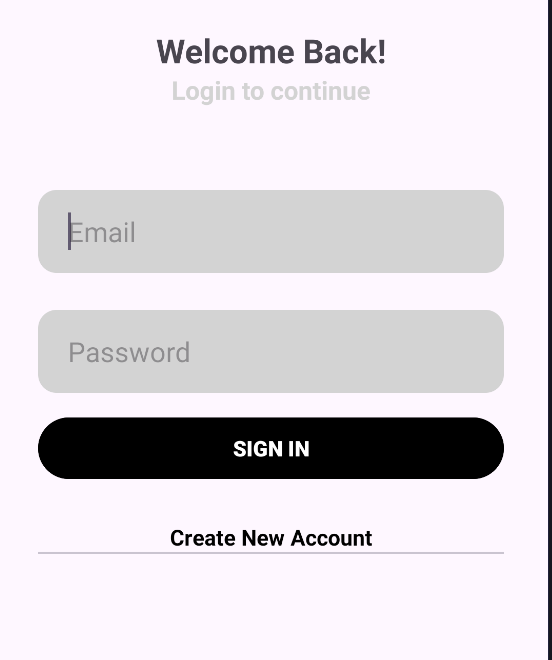
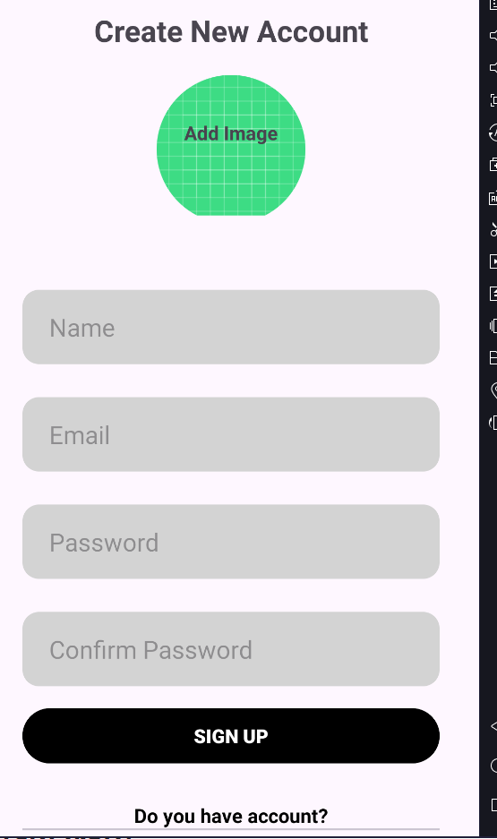

# Chat Application

## Introduction

This chat app provides essential features such as sign-up, log-in, and messaging. Additionally, the app can check if users are online, letting you know when your friends are available to chat. Built with the goal of providing a seamless and enjoyable communication experience using the language Kotlin in Android Native.

## Features

- Sign In / Sign Up / Sign Out
- Realtime Chat
- Recent Conversations
- User Availability

## Screenshots

<h3>Sign In</h3>
  

<h3>Sign Up</h3>
  

<h3>Home Screen</h3>
  

<h3>Chat Screen</h3>
  

<h3>Users Screen</h3>
  

## Tech Stack

**Programming Language:** Kotlin

**Databases:** Firebase, Room

## Reference

| Tool             | Link                                                                                           |
| ---------------- | ---------------------------------------------------------------------------------------------- |
| Firebase         | [Firebase](https://firebase.google.com/)                                                       |
| Room Database    | [Room Database](https://developer.android.com/training/data-storage/room)                      |
| Youtube          | [Youtube](https://www.youtube.com/watch?v=ENK4ONrRm8s&list=PLam6bY5NszYOhXkY7jOS4EQAKcQwkXrp4) |
| Glide            | [Glide](https://github.com/bumptech/glide)                                                     |
| Circle Indicator | [Circile Indicator](https://github.com/ongakuer/CircleIndicator)                               |
| MultiDex         | [MultiDex](https://developer.android.com/build/multidex)                                       |
| Retrofit         | [Retrofit](https://square.github.io/retrofit/)                                                 |

## Requirements

- SDK 34
- Firebase Firestore
- Retrofit
